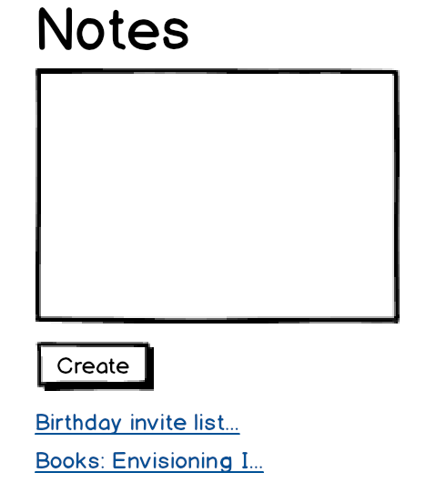

# Vanilla JavaScript Notes App

## App Info:

This single-page frontend-only Notes App displays a text box where a user can add text and submit a note. The notes first 20 characters is then listed below the textbox as a link, which if clicked will take the user to a hash url that displays the full content of that note. They can add as many notes as they like, with each new note added to the bottom of the note list. If the user creates a note with emoji shortcodes, e.g. :fire, this text is sent to an [external API](https://makers-emojify.herokuapp.com/) that converts shortcodes into emojis like 🔥. 

If the user were to refresh the page, their notes will disappear. 

## Notes App User Stories

We were given the user stories below to guide us:



```
As a programmer
I can see a list of my notes, where each note is abbreviated to the first 20 characters
So I can find the one I want
```

```
As a programmer
I can create a new note
So I can record something I need to remember
```

```
As a programmer
I can see the full text of an individual note on its own page
So I can see all the information in the note
```

```
As a programmer
I can use shortcodes like `:fire:` that get converted into emojis like 🔥
So I can record notes with fun little pictures
```
Technologies:
This is a single-page frontend only JS web app written in vanilla JS, with Jasmine as the testing framework. 
Structure
src/ contains all the domain logic. interface.js contains interactions with the user

Running this App:
- Git clone this repo
- npm install to create node_modules file and download dependencies. 
  This is required if you want to use http-server and visit localhost, rather than option 1 below. 
Option1:
- open index.html 
Option2:
- use http server 
$ node node_modules/http-server/bin/http-server

To run unit tests:
open SpecRunner.html

Note on tests: I used Jasmine for unit tests. Mocking has not yet been implemented and note-controller is not tested. If I had mocked all dependencies, I'd create a feature test where the models interact. 
I intend to use Cypress for user interaction testing/feature testing. 
